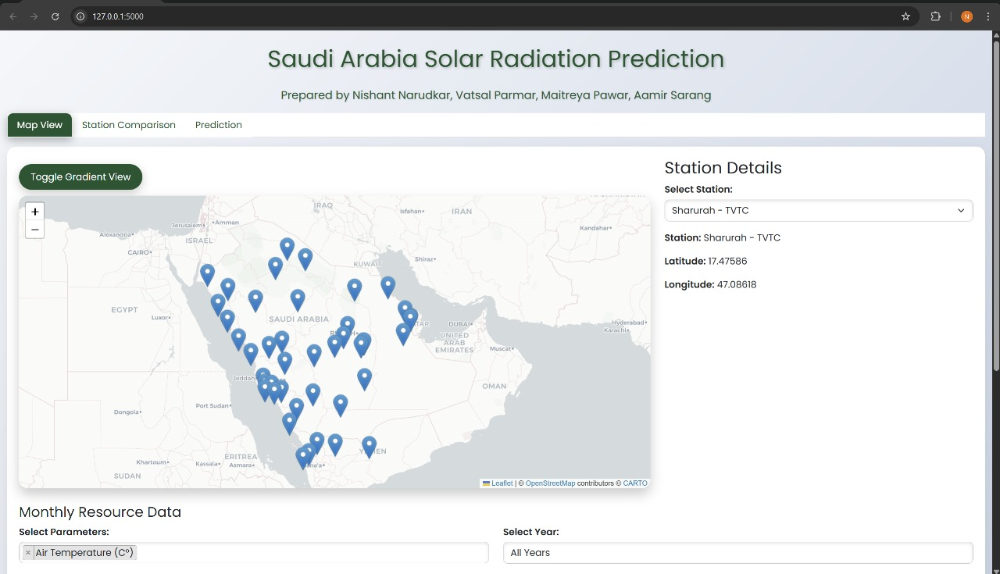
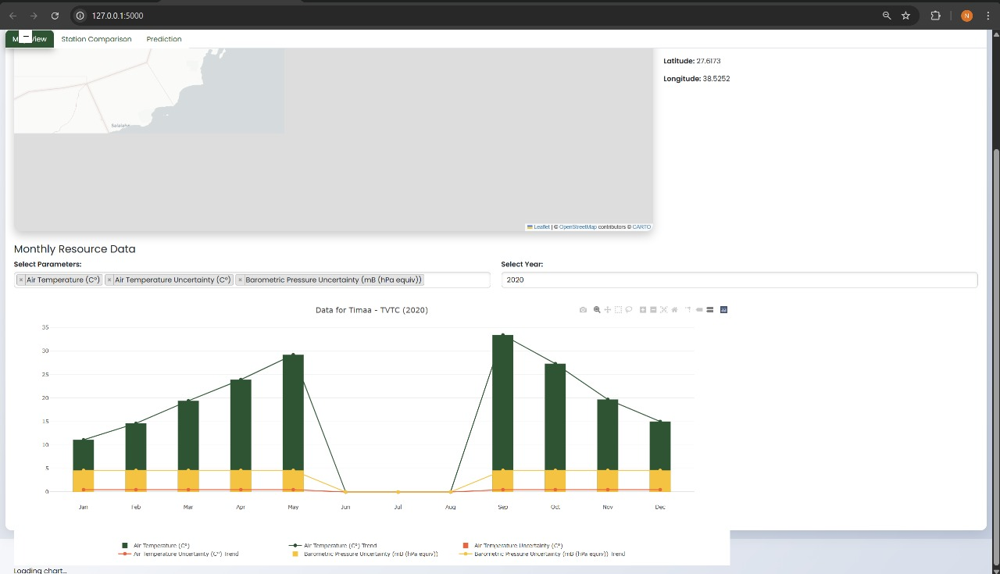
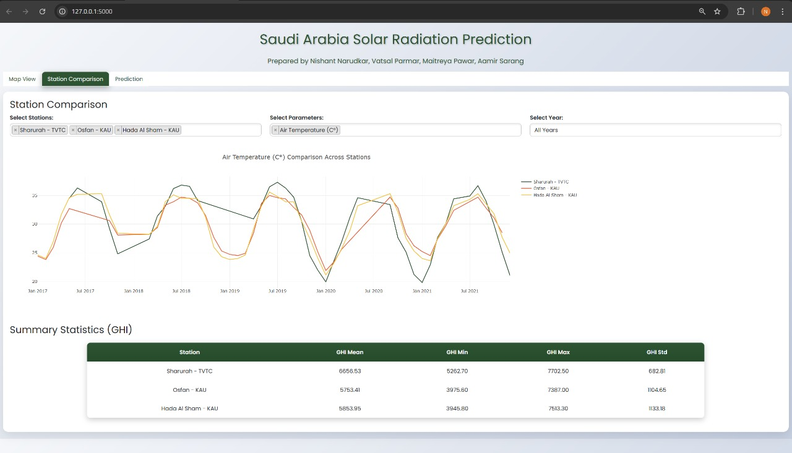
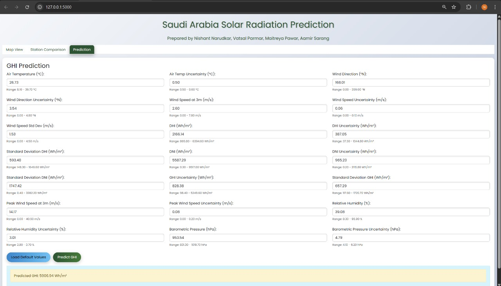

# ☀️ Solar Radiation Prediction using Saudi Arabia Dataset

This project predicts **Global Horizontal Irradiance (GHI)** using historical weather data from Saudi Arabia. It uses Machine Learning models to build an accurate forecasting system and deploys it as a web application for real-time GHI prediction.

---

## 📖 Project Overview

The goal of this project is to forecast **GHI (Global Horizontal Irradiance)** using machine learning models trained on **Saudi Arabia weather data (2015–2020)**. Accurate solar radiation prediction is critical for solar energy planning, grid optimization, and sustainable energy development.

---

## 📊 Dataset

- **Source:** [Saudi Open Data Portal](https://open.data.gov.sa/)
- **Records:** 2018 (from 57 weather stations)
- **Features:** 27 (Temperature, DHI, DNI, Wind Speed, Humidity, etc.)
- **Missing Values:** 2,175 entries

---

## 🛠 Technologies Used

- **Languages:** Python, HTML, CSS, JavaScript  
- **Libraries/Frameworks:**  
  - Scikit-learn  
  - Keras  
  - Pandas, NumPy, Matplotlib  
  - Flask (for backend)
- **Hosting:** Render
---

## 🤖 Model Training

We trained and compared the following models:
- Linear Regression (LR) ✅ *(used in deployment)*
- K-Nearest Neighbors (KNN)
- Support Vector Regression (SVR)
- Decision Tree (DT)
- Artificial Neural Network (ANN)
- Random Forest (RF)
- XGBoost
- Histogram Gradient Boosting (HGB)

### 📈 Evaluation Metrics:
- MAE (Mean Absolute Error)
- MSE (Mean Squared Error)
- RMSE (Root Mean Squared Error)
- R² Score
- Training Time

**Cross-validation:**
- 10-Fold
- 43-Fold (Leave-one-station-out)

---

## 🌐 Web Deployment

We deployed the final model using:
- **Model:** Linear Regression (due to low error & fast computation)
- **Hosting:** Render
- **Backend:** Flask
- **Frontend:** HTML, CSS, JS
- **Inputs:**  
1. **Air Temperature (C°)**
2. **Air Temperature Uncertainty (C°)**
3. **Wind Direction at 3m (°N)**
4. **Wind Direction at 3m Uncertainty (°N)**
5. **Wind Speed at 3m (m/s)**
6. **Wind Speed at 3m Uncertainty (m/s)**
7. **Wind Speed at 3m (std dev) (m/s)**
8. **DHI (Wh/m2)**
9. **DHI Uncertainty (Wh/m2)**
10. **Standard Deviation DHI (Wh/m2)**
11. **DNI (Wh/m2)**
12. **DNI Uncertainty (Wh/m2)**
13. **Standard Deviation DNI (Wh/m2)**
14. **GHI Uncertainty (Wh/m2)**
15. **Standard Deviation GHI (Wh/m2)**
16. **Peak Wind Speed at 3m (m/s)**
17. **Peak Wind Speed at 3m Uncertainty (m/s)**
18. **Relative Humidity (%)**
19. **Relative Humidity Uncertainty (%)**
20. **Barometric Pressure (mB (hPa equiv))**
21. **Barometric Pressure Uncertainty (mB (hPa equiv))**

These metrics must be provided in the correct format and order when making predictions.

The user inputs these features via the interface and gets the predicted GHI in real time.

## Screenshots

### Home Page


### Features Comparison


### Station Comparison


### Prediction Results


---

## Demo Video

Watch the demo video of the website [Youtube_Link](https://youtu.be/jLimPXA7apc).  

---

## 🧪 Results

| Model              | MAE (Wh/m²) | RMSE (Wh/m²) | R² Score | Training Time (s) |
|-------------------|-------------|--------------|----------|-------------------|
| Linear Regression | 135.94      | 193.74       | 0.97     | 0.01              |
| Histogram GB      | 140.58      | 192.11       | 0.98     | 0.83              |
| XGBoost           | 148.37      | 198.05       | 0.97     | 2.73              |
| ANN               | 154.4       | 241.22       | 0.96     | 10.6              |

---

## 🚀 How to Run

1. **Clone the repository:**
   ```bash
   git clone https://github.com/yourusername/solar-radiation-prediction.git
   cd solar-radiation-prediction

2.**Installation**

### Install Dependencies:
```bash
pip install -r requirements.txt
```

### Run the Flask App:
```bash
python app.py
```

### Open the Application:
Open your browser and navigate to (https://solar-radiation-prediction-using-saudi.onrender.com).

---

🔗 **Related Repositories**:
- 🔬 [Model Training & Evaluation Repo](https://github.com/nishnarudkar/Solar_Radiation_ML_Models)
- 🌐 [Web App Deployment Repo](https://github.com/nishnarudkar/Solar-Radiation-Prediction-using-Saudi-Arabia-Dataset)

---

## 🔮 Future Work

- Train deep learning sequential models for time-series forecasting.
- Extend the solution to other countries/regions.
- Improve the UI/UX of the web interface.

---

## 👨‍💻 Team Members
- [Nishant Narudkar] https://github.com/nishnarudkar
- [Maitreya Pawar] https://github.com/Metzo64
- [Vatsal Parmar] https://github.com/Vatsal211005
- @Aamir Sarang
---

## 🙏 Acknowledgements

We are grateful to our guide **Mr. Pramod H. Kachare** for his invaluable support and guidance throughout this project.

---

## 📄 License

This project is open-source under the **MIT License**.


